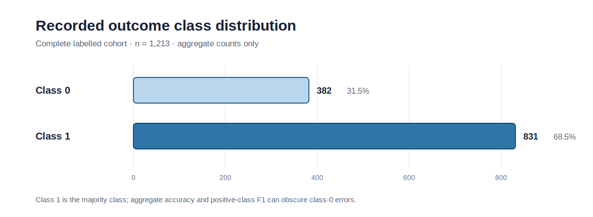
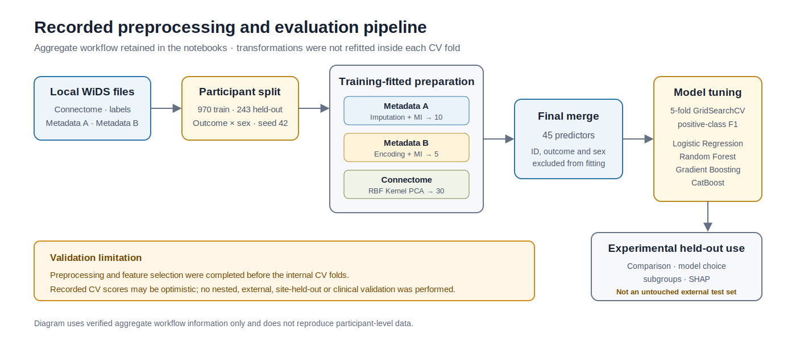
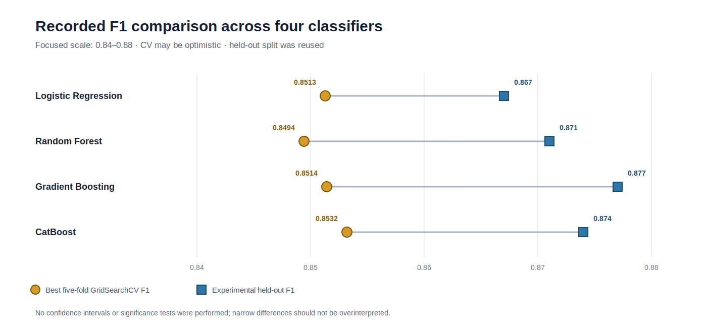

# ADHD Data Science and Machine Learning

An experimental data-science and machine-learning workflow for predicting a recorded binary outcome from psychometric, demographic, collection-context, and functional-connectivity features.

> [!CAUTION]
> **Prediction is not diagnosis.** This project is not a clinical tool, has not been clinically validated, and must not be used for screening, treatment, healthcare, insurance, education access, employment, or any other high-stakes decision. It has no documented NHS affiliation and does not establish GDPR compliance, causation, fairness, or absence of bias.

## Executive summary

| Item | Recorded value |
|---|---|
| Task | Experimental prediction of the binary `ADHD_Outcome` label |
| Dataset | WiDS Datathon 2025 |
| Participants | 1,213 |
| Split | 970 training / 243 experimental held-out |
| Final predictors | 45 |
| Models | Logistic Regression, Random Forest, Gradient Boosting, CatBoost |
| Strongest recorded held-out F1 | Gradient Boosting: 0.877 |
| Validation status | Internal experiment; no external, site-held-out, prospective, or clinical validation |



Class 1 accounts for 831 of 1,213 participants (68.5%). Positive-class metrics must be read alongside the substantially weaker class-0 recall recorded in the model outputs.

## Problem definition

The retained workflow predicts the recorded binary `ADHD_Outcome` label. The coded participant identifier, outcome, and recorded binary sex field are excluded from model fitting; the sex field is retained separately for exploratory subgroup comparisons.

The output is an experimental prediction for aggregate model evaluation. It is not an ADHD diagnosis, independent biomarker, clinical recommendation, or estimate of an individual's health status.

## Dataset source and access

The workflow uses **WiDS Datathon 2025** competition data. Kaggle hosts the competition, WiDS Worldwide organizes the challenge, and the data derive from upstream initiatives including the Healthy Brain Network.

- [Official WiDS Datathon 2025 competition](https://www.kaggle.com/competitions/widsdatathon2025/)
- [Official competition data page](https://www.kaggle.com/competitions/widsdatathon2025/data)
- [Healthy Brain Network](https://childmind.org/science/global-open-science/healthy-brain-network/)
- [Reproducible Brain Charts](https://github.com/pennlinc/ReproBrainChart)

Access requires a Kaggle account and acceptance of the competition rules. Use the updated `TRAIN_NEW` training materials where presented and cite the dataset as **WiDS Datathon 2025**.

### Public data boundary

This repository does not include, license, mirror, sample, archive, or redistribute participant-level data. Users must obtain the source files independently from the official Kaggle provider and comply with all applicable terms.

Only public guidance and `.gitkeep` placeholders are tracked under `data/`, `processed_data/`, and `final_data/`. Raw, processed, and merged participant files remain local and ignored. See [Dataset setup](docs/DATASET_SETUP.md).

## Dataset profile

| Aggregate property | Value |
|---|---:|
| Labelled participants | 1,213 |
| Class 0 | 382 |
| Class 1 | 831 |
| Class 1 share | 68.5% |
| Functional-connectome inputs | 19,900 |
| Brain regions represented | 200 |
| Final fitted predictors | 45 |

The inputs combine psychometric/questionnaire measures, demographic and collection-context fields, and functional MRI-derived connectivity features. Some symptom and questionnaire measures may overlap conceptually with the recorded outcome criteria; demographic and site-related variables may encode proxy or collection effects.

## Data preparation

The data-preparation notebook uses a participant-level 80/20 split stratified by the combination of outcome and the recorded binary sex field, with random state 42. The verified training and held-out participant-ID sets do not overlap.

| Feature group | Retained processing | Output |
|---|---|---:|
| Metadata A | Iterative imputation and mutual-information selection | 10 features |
| Metadata B | Categorical encoding and mutual-information selection | 5 features |
| Functional connectivity | RBF Kernel PCA | 30 components |
| **Merged model matrix** | Participant-aligned merge | **45 predictors** |



The diagram summarizes the retained aggregate workflow. It also marks the main validation limitation: preprocessing and feature construction were completed before the internal cross-validation folds.

## Models evaluated

The modelling notebook tunes and evaluates four classifiers:

- Logistic Regression
- Random Forest
- Gradient Boosting
- CatBoost

Each uses five-fold `GridSearchCV` with positive-class F1 as the scoring metric. The repository preserves the recorded model settings, outputs, and metrics; it does not include fitted model artifacts.

## Validation strategy

The 970-participant training split is used for preprocessing, feature construction, and hyperparameter search. The four tuned classifiers are then compared on the same 243-participant experimental held-out split.

Two design choices materially limit interpretation:

1. **Preprocessing outside CV folds:** imputation, feature selection, encoding, Kernel PCA, and relevant scaling were fitted on the complete training split before internal GridSearchCV folds. Recorded CV scores may be optimistic.
2. **Held-out reuse:** the held-out split was used for four-model evaluation, comparison, model choice, subgroup analysis, and SHAP interpretation. It is not an untouched external test set.

No nested CV, external cohort, independent site, prospective sample, confidence intervals, model-comparison tests, calibration study, or threshold analysis was performed.

## Model performance

The values below are retained from the owner-approved modelling notebook and were not recalculated. `CV F1` is the best positive-class F1 recorded during GridSearchCV; the other columns are positive-class metrics on the experimental held-out split.

| Model | CV F1 | Held-out accuracy | Held-out precision | Held-out recall | Held-out F1 |
|---|---:|---:|---:|---:|---:|
| Logistic Regression | 0.8513 | 0.802 | 0.805 | 0.940 | 0.867 |
| Random Forest | 0.8494 | 0.807 | 0.803 | 0.952 | 0.871 |
| Gradient Boosting | 0.8514 | 0.815 | 0.808 | 0.958 | 0.877 |
| CatBoost | 0.8532 | 0.811 | 0.807 | 0.952 | 0.874 |

Gradient Boosting has the strongest recorded held-out F1 (0.877), while CatBoost has the strongest recorded CV F1 (0.8532). The differences are narrow and were not tested for statistical significance.



The focused-scale dot plot makes the narrow recorded differences visible. It does not imply that the models are statistically distinguishable or that the held-out estimates generalize beyond this experiment.

## Error analysis


The unchanged notebook-derived confusion matrix covers the 243-participant experimental held-out split. It shows high class-1 recall alongside substantially weaker class-0 recall. Aggregate accuracy and positive-class F1 therefore do not describe balanced performance across both classes.

No clinical cost model, threshold optimization, balanced-accuracy comparison, confidence interval, or decision-curve analysis was retained.

## Fairness and bias analysis

The fairness-related outputs are exploratory comparisons across the recorded binary sex field. The held-out groups are unequal: 160 participants in one recorded group and 83 in the other; class-specific groups are smaller still.

The analysis does not include confidence intervals, significance tests, equalized-odds, demographic-parity, calibration-parity, threshold sensitivity, or intersectional evaluation. It does not establish that any model is fair or bias-free. The two historical subgroup PNGs remain in `docs/images/` for notebook-output preservation but are intentionally not used as prominent README evidence.

See [Fairness and bias](docs/FAIRNESS_AND_BIAS.md) for the complete boundary.

## Explainability


The unchanged notebook-derived SHAP summary describes model-specific feature contributions within the recorded dataset and feature representation. SHAP values do not establish biological importance, clinical mechanism, causal relationships, or stable effects in other populations.

## Methodological limitations

- Class 1 is the majority class, and class-0 recall is substantially weaker.
- Optimization focuses on positive-class F1.
- Preprocessing and feature construction occur before the internal CV folds.
- The experimental held-out split is reused for multiple analytical purposes.
- Some symptom and questionnaire variables may overlap the recorded outcome criteria.
- Demographic, race, site, scan-location, enrolment-year, and collection-context variables may encode proxies or confounding.
- Encoded categorical values are treated numerically; CatBoost is not supplied explicit categorical-feature metadata.
- No nested CV, external/site-held-out validation, prospective evaluation, calibration, threshold study, uncertainty intervals, or formal fairness validation is retained.
- SHAP output is associative and model-specific, not causal or clinical evidence.

These limitations are documented rather than scientifically reworked. See [Methodology](docs/METHODOLOGY.md), [Evaluation](docs/EVALUATION.md), and the [model card](MODEL_CARD.md).

## Repository structure

```text
ADHD_Data_Science_ML/
├── README.md
├── LICENSE
├── MODEL_CARD.md
├── RESPONSIBLE_USE.md
├── THIRD_PARTY_NOTICES.md
├── CONTRIBUTING.md
├── SECURITY.md
├── CODE_OF_CONDUCT.md
├── requirements.txt
├── data/                 # local source files are ignored
├── processed_data/       # generated participant files are ignored
├── final_data/           # generated participant files are ignored
├── docs/
│   ├── DATASET_SETUP.md
│   ├── METHODOLOGY.md
│   ├── EVALUATION.md
│   ├── FAIRNESS_AND_BIAS.md
│   ├── REPRODUCIBILITY.md
│   ├── NOTEBOOK_INTEGRITY.md
│   └── images/
├── notebooks/
│   ├── 1_data_eploration.ipynb
│   └── 2_modeling.ipynb
└── scripts/
    ├── validate_notebook_integrity.py
    └── validate_public_repository.py
```

## Dataset setup

After accepting the official competition rules, place these files under `data/`:

```text
data/
├── FUNCTIONAL_CONNECTOME_MATRICES.csv
├── LABELS.xlsx
├── METADATA_A.xlsx
└── METADATA_B.xlsx
```

No files from `processed_data/` or `final_data/` are provided. Follow [Dataset setup](docs/DATASET_SETUP.md) for the full access and non-redistribution guidance.

## Environment setup

Notebook metadata records Python 3.12.7. Exact historical dependency versions were not preserved, so `requirements.txt` remains unpinned and is not a verified environment lock.

```bash
python3 -m venv .venv
source .venv/bin/activate
python -m pip install -r requirements.txt
```

Generating a trustworthy constraints or lock file requires a separately validated clean environment; package versions are not guessed here.

## Usage

Open Jupyter with `notebooks/` as the working directory so the recorded relative paths resolve to `../data/`, `../processed_data/`, and `../final_data/`.

Run in this order only when you have authorized local dataset access and intend to reproduce the complete workflow:

1. [Data exploration and preparation notebook](notebooks/1_data_eploration.ipynb)
2. [Modelling and evaluation notebook](notebooks/2_modeling.ipynb)

Executing the notebooks generates local participant-level files and retrains models. It is not required to review the retained public outputs.

## Reproducibility

- Notebook metadata records Python 3.12.7.
- The participant split and several model operations use random state 42 where recorded.
- At least one exploratory plotting sample is unseeded.
- Historical execution counts are non-sequential.
- No fitted model artifacts are published; reproduction requires full retraining.
- Exact package versions are unavailable.
- Notebook hashes protect the owner-approved byte state.

See [Reproducibility](docs/REPRODUCIBILITY.md) and [Notebook integrity](docs/NOTEBOOK_INTEGRITY.md).

## Responsible-use boundaries

Do not use this project for diagnosis, screening, treatment, clinical triage, insurance, education access, employment, benefits, or decisions about an identifiable person. Do not present its outputs as clinical validation, medical advice, NHS work, GDPR compliance, deployment approval, causal evidence, fairness certification, or bias elimination.

The notebooks preserve owner-approved historical wording. Any stronger language inside them is historical experimental narrative and is not endorsed as a clinical, NHS, compliance, deployment, or fairness claim. The controlling public boundary is [Responsible use](RESPONSIBLE_USE.md).

## Future improvements

Evidence-led scientific improvements would require a new, separately approved workflow rather than changes to the retained notebooks:

- place all preprocessing and feature selection inside CV pipelines;
- use nested cross-validation for tuning and model comparison;
- reserve a genuinely untouched final test cohort;
- add site-held-out and external validation;
- quantify uncertainty and perform formal model comparisons;
- evaluate calibration and prespecified decision thresholds;
- broaden subgroup and intersectional evaluation with uncertainty estimates;
- assess proxy sensitivity and criterion overlap;
- create a verified dependency lock in a clean environment.

## Attribution

- Dataset citation: **WiDS Datathon 2025**
- Competition: [WiDS Datathon 2025 on Kaggle](https://www.kaggle.com/competitions/widsdatathon2025/)
- Source initiative: [Healthy Brain Network](https://childmind.org/science/global-open-science/healthy-brain-network/)
- Related upstream resource: [Reproducible Brain Charts](https://github.com/pennlinc/ReproBrainChart)

Dataset and upstream materials remain governed by their original terms. See [Third-party notices](THIRD_PARTY_NOTICES.md).

## Licence

Original public code and documentation are available under the [MIT License](LICENSE), copyright 2026 Alireza Zaeri and Fatemeh Sabourinia.

The MIT licence does not apply to WiDS Datathon 2025 data, Healthy Brain Network data, Reproducible Brain Charts data, participant-level files, restricted data-dictionary content, third-party dependencies, or external trademarks.

## Contributors

Developed by:

- [Alireza Zaeri](https://github.com/alirezazaeri)
- [Fatemeh Sabourinia](https://github.com/fatemehsabourinia)
