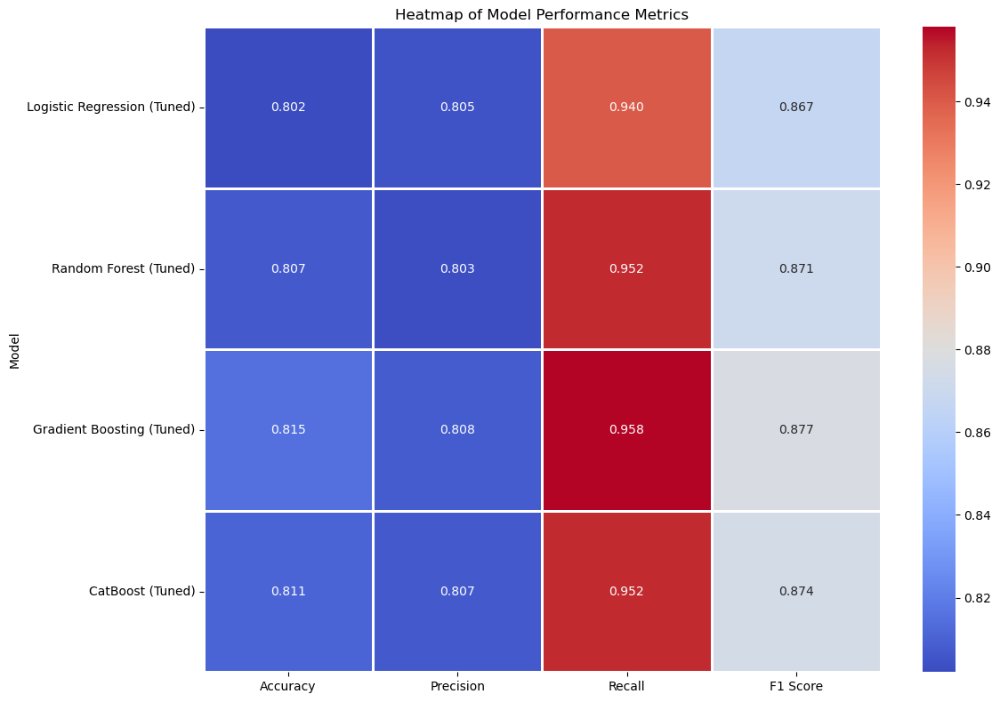
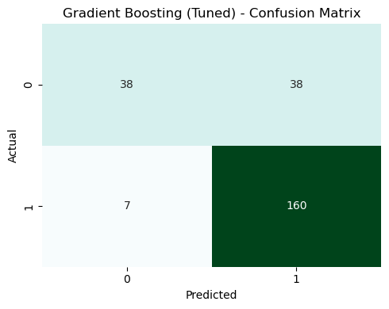
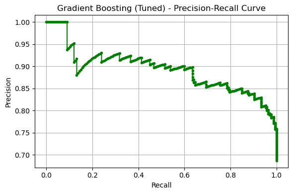
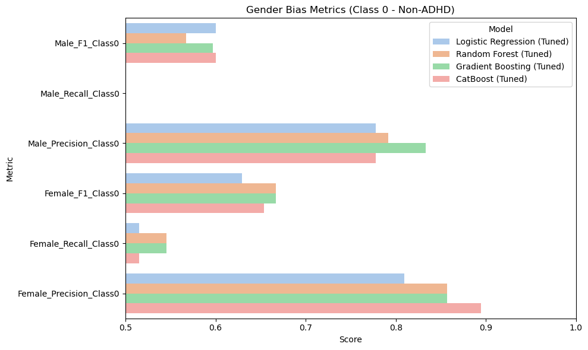
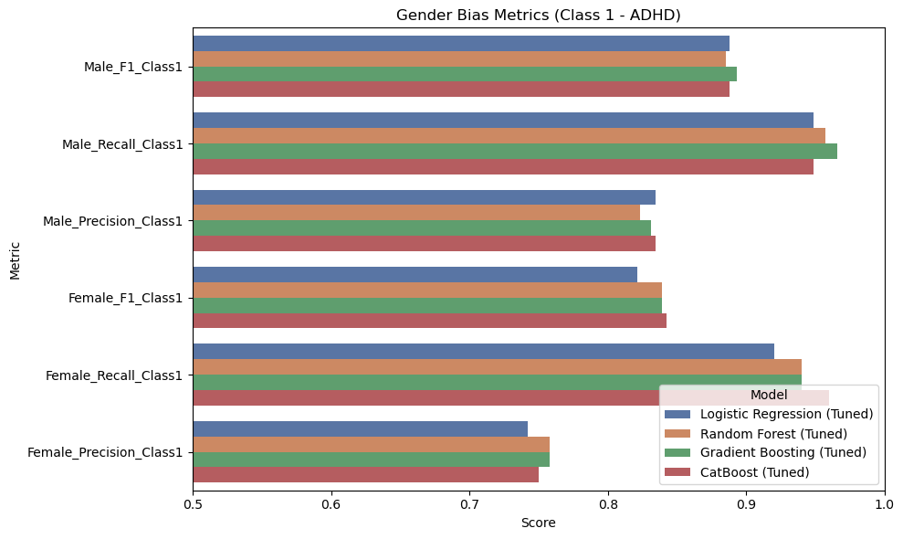
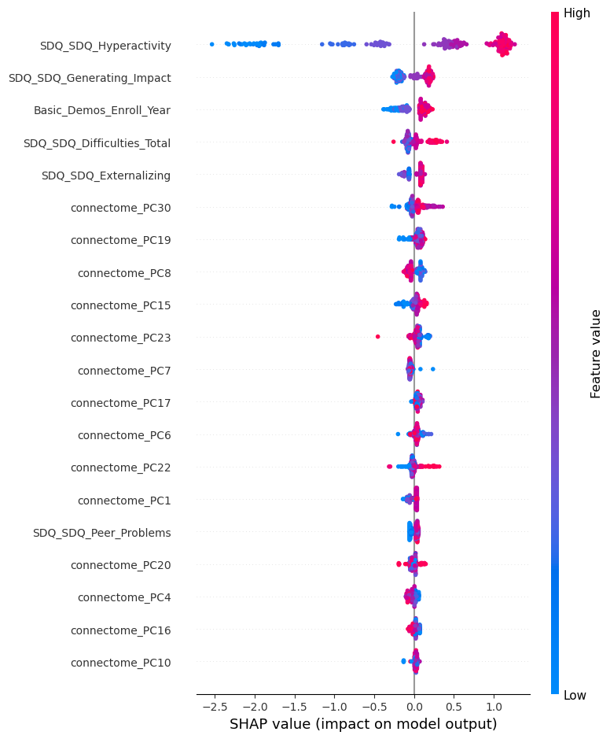

# ADHD Data Science and Machine Learning

*A machine learning workflow for ADHD classification using neuroimaging, psychometric, and demographic data*

## Overview

Developed a Data Science and Machine Learning solution for ADHD classification using neuroimaging and demographic data, focusing on model evaluation, hyperparameter optimization, cross-validation, and fairness analysis.

In this project, fairness analysis refers to an exploratory comparison of model performance across the recorded binary sex groups.

The workflow combines psychometric and questionnaire measures, demographic variables, and functional MRI-derived connectivity features. It records data preparation, feature selection, four tuned classifiers, held-out evaluation, exploratory subgroup comparisons, and SHAP-based model interpretation.

## Responsible-use notice

> **This project is a research and portfolio demonstration. It is not a clinical diagnostic tool and must not be used for medical decision-making.**

The recorded results are specific to the available dataset, split, preprocessing choices, and experimental design. They do not establish clinical validity or performance beyond this setting.

## Project highlights

- 1,213 labeled participants with psychometric, demographic, outcome, and functional-connectivity information
- 19,900 upper-triangle functional-connectome connections derived from 200 brain regions
- Participant-level 80/20 split stratified by outcome and the recorded binary sex field
- Iterative imputation, mutual-information feature selection, and RBF KernelPCA
- Logistic Regression, Random Forest, Gradient Boosting, and CatBoost tuned with GridSearchCV
- Recorded held-out model comparison and exploratory sex subgroup performance analysis
- Exploratory SHAP feature attribution for model associations

## Dataset overview

The project uses the **WiDS Datathon 2025 Global Challenge dataset**. Kaggle hosted the competition, WiDS Worldwide organized the challenge, and the data derive from the Healthy Brain Network initiative of the Child Mind Institute.

The supplied competition data include demographic information, diagnostic or outcome labels, psychometric and questionnaire features, and functional MRI-derived connectivity features. The recorded analysis uses a binary ADHD outcome and a binary sex field.

## Data availability

Raw, processed, and participant-level dataset files are not included in this repository. The project uses the WiDS Datathon 2025 Global Challenge dataset derived from Healthy Brain Network data. Access is subject to the original provider and competition terms. Obtain the dataset through the official Kaggle competition or provider channel and place the downloaded files locally according to the documented project structure.

Users must obtain the dataset independently, follow the official access terms, place the source files in the expected local directories, and preserve the existing filenames used by the notebooks. This repository does not own, license, mirror, or grant redistribution permission for the dataset.

- [Kaggle competition](https://www.kaggle.com/competitions/widsdatathon2025/)
- [WiDS challenge overview](https://www.widsworldwide.org/get-inspired/blog/8th-annual-wids-datathon-challenges-unraveling-the-mysteries-of-the-female-brain/)
- [Healthy Brain Network](https://childmind.org/science/global-open-science/healthy-brain-network/)

## Problem definition

The recorded workflow predicts the binary `ADHD_Outcome` label from prepared psychometric, demographic, and connectome-derived predictors. The modeling notebook removes participant ID, outcome, and sex before model fitting. The binary sex field is retained separately for the recorded exploratory subgroup comparison.

## Dataset composition

| Item | Recorded value |
|---|---:|
| Unique participants | 1,213 |
| Class 0 | 382 |
| Class 1 | 831 |
| Class 1 share | Approximately 68.5% |
| Raw connectome features | 19,900 |
| Brain regions represented | 200 |
| Final model predictors | 45 |

Class 1 is the majority class. Model optimization focused on positive-class F1, and positive-class recall was high, while class-0 recall was substantially lower. Balanced accuracy, Matthews correlation coefficient, confidence intervals, calibration, and threshold analysis were not included in the recorded workflow.

## Data preparation workflow

1. Load the connectome matrix, labels, Metadata A, and Metadata B.
2. Create an 80/20 participant-level split using outcome and binary sex combinations for stratification.
3. Apply iterative imputation to Metadata A using training-fitted transformations.
4. Select ten Metadata A features using mutual information with the training target.
5. Handle categorical Metadata B fields and select five features using mutual information.
6. Reduce 19,900 connectome features to 30 RBF KernelPCA components.
7. Merge the selected psychometric, demographic, connectome, and label tables.
8. Remove participant ID, outcome, and sex before fitting the models.

## Feature groups

| Feature group | Recorded processing | Final contribution |
|---|---|---:|
| Psychometric and questionnaire | Iterative imputation and mutual-information selection | 10 features |
| Demographic and collection context | Categorical handling and mutual-information selection | 5 features |
| Functional connectivity | RBF KernelPCA | 30 components |

The psychometric predictors include symptom and questionnaire measures that may overlap conceptually with ADHD evaluation. Demographic and collection-context fields may also encode site-related or demographic proxies.

## Train and held-out split

| Split property | Recorded value |
|---|---:|
| Training rows | 970 |
| Held-out rows | 243 |
| Split ratio | 80/20 |
| Random state | 42 |
| Stratification | Outcome and binary sex combinations |
| Participant-ID overlap | 0 |

The held-out set was reused for evaluation of multiple tuned models, model comparison, subgroup analysis, and model interpretation. It should therefore be treated as an experimental held-out set rather than an untouched external evaluation.

## Models evaluated

The executable notebook code implements four classifiers:

- Logistic Regression
- Random Forest
- Gradient Boosting
- CatBoost

## Hyperparameter optimization

All four verified models were tuned with `GridSearchCV`. The grids cover regularization and solver choices for Logistic Regression, tree count and depth controls for Random Forest, learning and tree controls for Gradient Boosting, and iteration, depth, learning-rate, and regularization controls for CatBoost.

## Cross-validation

GridSearchCV used five folds and positive-class F1 as its scoring metric. In the recorded workflow, preprocessing and feature selection were completed before the internal GridSearchCV folds.

> Because preprocessing and feature selection were completed before the internal GridSearchCV folds, the recorded cross-validation scores may be optimistic.

## Recorded evaluation results

| Model | Best CV F1 | Held-out accuracy | Precision | Recall | F1 |
|---|---:|---:|---:|---:|---:|
| Logistic Regression | 0.8513 | 0.802 | 0.805 | 0.940 | 0.867 |
| Random Forest | 0.8494 | 0.807 | 0.803 | 0.952 | 0.871 |
| Gradient Boosting | 0.8514 | 0.815 | 0.808 | 0.958 | 0.877 |
| CatBoost | 0.8532 | 0.811 | 0.807 | 0.952 | 0.874 |

Gradient Boosting achieved the highest recorded held-out F1. CatBoost achieved the highest recorded cross-validation F1. Metrics were preserved from existing notebook outputs and were not recomputed during repository preparation.

These results must be read alongside the class imbalance and lower class-0 recall. The held-out set was reused for model comparison, subgroup analysis, and interpretation, so the recorded results should be treated as experimental rather than as an untouched final external evaluation.

## Model comparison

The recorded held-out comparison shows a narrow range across all four tuned models. Recall for class 1 is consistently high, but this does not resolve the lower recall for class 0 or establish performance outside the recorded dataset.



*The heatmap compares recorded held-out accuracy, precision, recall, and F1. Cross-validation F1 appears separately in the results table.*

### Gradient Boosting held-out evaluation



*The confusion matrix shows the recorded predictions on the 243-row experimental held-out set. It highlights high class-1 recall alongside substantially lower class-0 recall.*



*The precision-recall curve is an existing held-out notebook output. It was copied without recomputation or restyling.*

## Exploratory subgroup performance analysis

The fairness-related work is an **exploratory sex subgroup performance analysis**. The held-out sample contains 160 participants in one recorded sex group and 83 in the other. Subgroup sizes are unequal, and the class-specific groups are smaller still.

Confidence intervals and significance tests were not calculated. Equalized odds, calibration parity, intersectional analysis, and complete race or site subgroup analysis were not performed. These observations do not provide fairness certification or establish universal fairness.



*This existing notebook output compares class-0 precision, recall, and F1 across the recorded binary sex groups for all four models. The original figure labels are preserved. The comparison is exploratory.*



*This existing notebook output compares class-1 precision, recall, and F1 across the recorded binary sex groups for all four models. Unequal subgroup sizes and the absence of uncertainty estimates limit interpretation.*

## SHAP-based model interpretation

SHAP is used for exploratory feature attribution analysis. It explains associations and contributions within the trained model; it does not establish biological or clinical causation. The attributions depend on the trained model, the recorded dataset, and the selected feature representation.



*The SHAP summary shows how recorded feature values contributed to the tuned Gradient Boosting model output. It describes model behavior, not causes of ADHD.*

## Selected project figures

The figures above are exact PNG outputs extracted from the existing modeling notebook. They were not rerun, redrawn, recolored, approximated, or regenerated. The selected set focuses on model comparison, held-out error patterns, precision-recall behavior, exploratory subgroup comparisons, and non-causal model interpretation.

## Project structure

```text
ADHD_Data_Science_ML/
├── README.md
├── requirements.txt
├── data/
│   ├── README.md
│   └── .gitkeep
├── processed_data/
│   ├── README.md
│   └── .gitkeep
├── final_data/
│   ├── README.md
│   └── .gitkeep
├── docs/
│   └── images/
└── notebooks/
    ├── 1_data_eploration.ipynb
    └── 2_modeling.ipynb
```

Participant-level data, notebook checkpoints, generated CatBoost state, logs, caches, and local metadata are excluded from public scope.

## Technology stack

- Python
- Jupyter Notebook
- pandas
- NumPy
- matplotlib
- seaborn
- scikit-learn
- CatBoost
- SHAP
- openpyxl for Excel reading

Notebook metadata records Python 3.12.7. Exact package versions were not preserved, so the dependency list is intentionally unpinned.

## Local setup

1. Clone the future repository.
2. Create and activate a virtual environment:

   ```bash
   python3 -m venv .venv
   source .venv/bin/activate
   ```

3. Install the verified libraries:

   ```bash
   python -m pip install -r requirements.txt
   ```

4. Obtain the dataset from the official source under its original terms.
5. Place the files in the expected local directories without changing their filenames.
6. Open the notebooks from the existing `notebooks/` directory.

This is a practical setup guide, not a claim of one-command reproducibility.

## Dataset placement

Preserve this local structure:

```text
ADHD_Data_Science_ML/
├── data/
│   ├── FUNCTIONAL_CONNECTOME_MATRICES.csv
│   ├── LABELS.xlsx
│   ├── METADATA_A.xlsx
│   └── METADATA_B.xlsx
├── processed_data/
├── final_data/
└── notebooks/
    ├── 1_data_eploration.ipynb
    └── 2_modeling.ipynb
```

The notebooks use existing relative paths. Open them with `notebooks/` as the working directory so that `../data/`, `../processed_data/`, and `../final_data/` resolve as recorded.

## Notebook execution order

1. Run `notebooks/1_data_eploration.ipynb` to prepare the local processed and final datasets.
2. Run `notebooks/2_modeling.ipynb` to reproduce the recorded modeling workflow in a compatible environment.

The repository retains the existing filename `1_data_eploration.ipynb` to preserve the original project structure.

## Reproducibility notes

- Notebook metadata records Python 3.12.7.
- Exact package versions were not preserved.
- The notebooks use the existing relative project paths described above.
- Execution counts are preserved as recorded.
- The modeling notebook contains its original saved source and outputs.
- Repository preparation did not rerun notebooks, retrain models, recompute metrics, or alter the scientific workflow.
- A compatible local environment and independently obtained dataset are required.

## Methodological limitations

- Class 1 represents approximately 68.5 percent of participants.
- Optimization focused on positive-class F1, and class-0 recall was substantially lower.
- Preprocessing and feature selection were completed before the internal CV folds, which may make recorded CV estimates optimistic.
- The held-out set was reused for multiple-model evaluation, comparison, subgroup analysis, and interpretation.
- No external or site-held-out validation was performed.
- Site and demographic variables may act as proxy features.
- Symptom and questionnaire predictors may overlap conceptually with ADHD evaluation.
- Subgroup findings are exploratory and based on unequal group sizes.
- Confidence intervals, calibration, threshold analysis, and complete fairness validation were not included.
- Clinical validation is outside the scope of this project.

These limitations define future-improvement opportunities and the boundaries of the recorded results.

## Ethical and clinical limitations

This project is a research and portfolio demonstration. It is not a clinical diagnostic tool and must not be used for medical decision-making. Results should not be generalized beyond the recorded dataset and experimental design. Feature associations do not establish causation, and subgroup observations do not establish universal fairness. Dataset use remains governed by the original provider and competition terms.

## Authors

This project was developed by Alireza Zaeri and Fatemeh Sabourinia.

- [Alireza Zaeri on GitHub](https://github.com/alirezazaeri)
- [Alireza Zaeri on LinkedIn](https://www.linkedin.com/in/alirezazaeri)
- Fatemeh Sabourinia

## Dataset attribution

- Competition host: [Kaggle](https://www.kaggle.com/competitions/widsdatathon2025/)
- Challenge organizer: [WiDS Worldwide](https://www.widsworldwide.org/get-inspired/blog/8th-annual-wids-datathon-challenges-unraveling-the-mysteries-of-the-female-brain/)
- Source initiative: [Healthy Brain Network](https://childmind.org/science/global-open-science/healthy-brain-network/)
- Source organization: Child Mind Institute

The dataset and competition materials remain subject to their original terms and are not covered by any future code license for this repository.

## License status

License information will be added after final authorship and third-party terms review.
